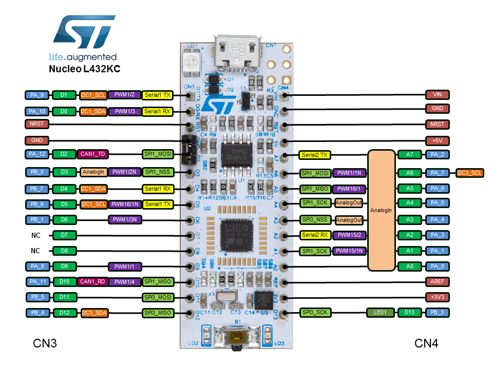

# nucleo-l432kc-quickstart


## Hardware

* [NUCLEO-L432KC](https://www.st.com/en/evaluation-tools/nucleo-l432kc.html) STM32 Nucleo-32 development board with STM32L432KC MCU



* Configure udev rules for the embedded ST-Link v2-1

```bash
# download the OpenOCD rules file and copy it to the right location
wget -O 60-openocd.rules https://sf.net/p/openocd/code/ci/master/tree/contrib/60-openocd.rules?format=raw
sudo cp 60-openocd.rules /etc/udev/rules.d

# ask the udev daemon to reload these rules
sudo udevadm control --reload
```

## Dependencies for Debian Buster

* VS Code with the Rust and Cortex-Debug add-ins
If you have the `code` command in your path, you can run the following commands to install the necessary extensions.

```bash
code --install-extension rust-lang.rust
code --install-extension marus25.cortex-debug
```

* The thumbv7em-none-eabihf Rust target

```bash
rustup target add thumbv7em-none-eabihf
```

* OpenOCD

```bash
sudo apt-get install openocd
```

* GDB

```bash
# or gdb-arm-none-eabi on some other Linux distros
sudo apt-get install gdb-multiarch

# workaround: the current version of the cortex-debug doesn't allow you to specify the name of the gdb executable
sudo ln -s /usr/bin/gdb-multiarch /usr/bin/arm-none-eabi-gdb
```

## Run and Debug

Just put a breakpoint where you want it and press F5

## License

Licensed under either of

- Apache License, Version 2.0 ([LICENSE-APACHE](LICENSE-APACHE) or
  http://www.apache.org/licenses/LICENSE-2.0)
- MIT license ([LICENSE-MIT](LICENSE-MIT) or http://opensource.org/licenses/MIT)

at your option.

### Contribution

Unless you explicitly state otherwise, any contribution intentionally submitted
for inclusion in the work by you, as defined in the Apache-2.0 license, shall be
dual licensed as above, without any additional terms or conditions.
